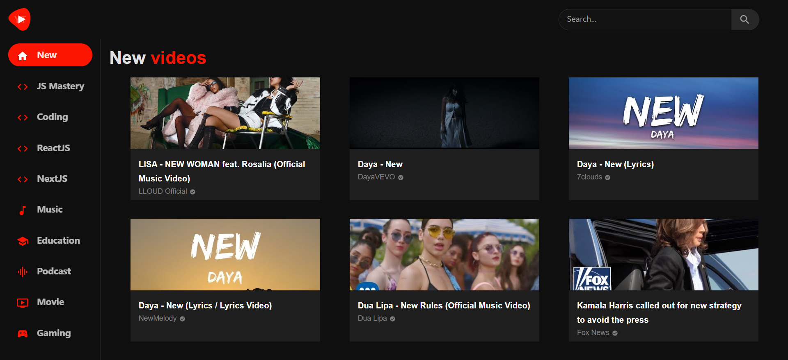

<div align="center">
  <a href="https://modernyoutubecm.netlify.app/" target="_blanck"></a>
  <h3 align="center">Modern Youtube</h3>
</div>

## <br /> 📋 <a name="table">Summary</a>


- ✨ [Introduction](#introduction)
- 🛠 [Technology Used](#tech-stack)
- 🚀 [Launch App](#launch-app)
- 🎨 [Styling](#style)

## <br /> <a name="introduction">✨ Introduction</a>

[ENG] : This project is a YouTube clone, designed to replicate some of the popular platform's features. It was built using React, TailwindCSS and Material UI (MUI).

Data integration was achieved through RapidAPI and the YouTube v3 API

The site features a fully functional search bar, a dynamic feed displaying the latest videos, and channel pages showing subscriber counts and video collections.

[FR] : Ce projet est un clone de YouTube, conçu pour répliquer certaines fonctionnalités de la célèbre plateforme. Il a été développé en utilisant React, TailwindCSS et Materialet UI (MUI).

L'intégration des données a été réalisée grâce à RapidAPI et l'API YouTube v3

Le site propose une barre de recherche fonctionnelle, un feed dynamique présentant les dernières vidéos, ainsi que des pages de chaînes affichant le nombre d'abonnés et les vidéos associées.

## <br /> <a name="tech-stack">🛠 Technology Used</a>

- [react-router-dom](https://www.npmjs.com/package/react-router-dom)
  The react-router-dom package contains bindings for using React Router in web applications. Please see the Getting Started guide for more information on how to get started with React Router.

- [react-player](https://www.npmjs.com/package/react-player)
A React component for playing a variety of URLs, including file paths, YouTube, Facebook, Twitch, SoundCloud, Streamable, Vimeo, Wistia, Mixcloud, DailyMotion and Kaltura.

- [RAPID_API](https://docs.rapidapi.com/docs/navigating-this-documentation)
Platform that provides access to thousands of APIs through a single unified platform. Allows developers to discover, connect, and manage APIs in one place, simplifying the process of integrating third-party APIs into applications.

- [axios](https://www.npmjs.com/package/axios)
popular JavaScript library used to make HTTP requests from the browser or Node.js, allows to send asynchronous HTTP requests to REST endpoints and perform CRUD operations

- [mui/material](https://www.npmjs.com/package/@mui/material)
Material UI is an open-source React component library that implements Google's Material Design. It's comprehensive and can be used in production out of the box.

- [mui/icons-material](https://mui.com/material-ui/material-icons/)
@mui/icons-material includes the 2,100+ official Material Icons converted to SvgIcon components. It depends on @mui/material, which requires Emotion packages.

- [TailwindCSS](https://tailwindcss.com/docs/installation)


## <br /> <a name="launch-app">🚀 Launch App</a>

<br/>**Cloning the Repository**

```bash
git clone {git remote URL}
```

<br/>**installation**

> After cloning the repository, run the command `npm install` to install the project's dependencies.

> Once the dependencies are installed, start the project with the command `npm run dev`.

## <br /> <a name="style">🎨 Styling</a>

Global styling are defined using @mui/material and TailwindCSS in the tailwind.config.js file.

```
theme: {
    extend: {
      colors: {
        primary: "#0F0F0F",
        borderRight: "#3d3d3d",
        red: "#FC1503",
        cardContent: "#1e1e1e",
        gray: "#a0a0a0",
        lightBlack: 'hsl(0,0%,7%)'
      },
      screens: {
        vsm: "425px",
        xs: "900px",
      },
    },
  },
```
